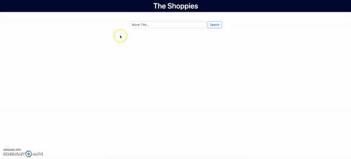

# The Shoppies

## Description
A simple web app that allows the user to search movies using OMDB api. The app allows the users to nominate up to five movies.

Nominated movies are saved in the localstorage of the browser therefore when user reloads the page, nominated movies are not lost

## Usage
mohmedvaid.github.io/theshoppies/

## Credits

Bootstrap v4.4.1 https://getbootstrap.com/

JQuery v3.4.1 https://jquery.com/

Animate Style https://animate.style/
